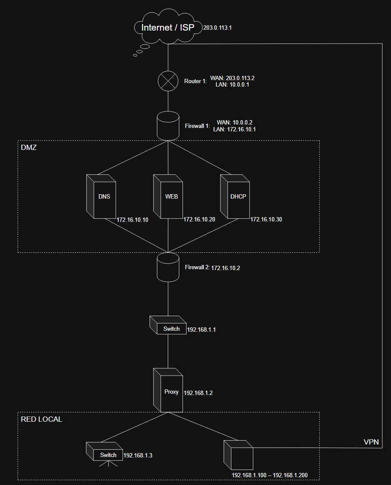

Grupo 4: [Enlace](https://docs.google.com/document/d/1LTntS4XiJKY-IBnKUdTa4O-5nXqWM1xAETUEysznwmE/edit?tab=t.0) 

[Presentación](https://docs.google.com/presentation/d/1danDSW8g8AXh0i6WbBQSem3vf5tU0sxoRe4DgfGcOGg/edit?usp=sharing)

# Estudio de los siguientes temas:

## FIREWALL:

El firewall es una tecnología que añade una capa de seguridad a las redes, actuando como muro (de ahí su nombre), y permitiendo el paso a las conexiones que se consideren seguras. Supongamos, por ejemplo, que han comprometido a un equipo dentro de una empresa, han instalado un keylogger, ¿Cómo podría mandar este la información si todos los puertos que acceden a Internet están cerrados? No puede, por eso el firewall añade una capa de seguridad tan potente. Uno puede especificar por qué puertos, por qué interfaces va a haber qué puertos abiertos. También se puede programar un cierre bajo algunas condiciones específicas.

Existen 3 tipos de firewall, dependiendo de dónde se apliquen. No es lo mismo un firewall de aplicación que un firewall host, y lo mismo sucede con el firewall físico.

## DMZ:

**Definición:**

La DMZ es una parte de la red diseñada como una zona intermedia entre la red interna privada y la red externa (Internet). Su objetivo es crear una separación que ayude a proteger los sistemas internos frente a accesos no autorizados.

**Función:**

La función principal de la DMZ es actuar como una barrera de seguridad, permitiendo que ciertos servicios sean accesibles desde Internet sin comprometer directamente la red interna de la organización.

**Ubicación:**

La DMZ se sitúa entre Internet y la red interna y suele estar protegida por uno o dos firewalls que controlan el tráfico que entra y sale de cada zona.

**Servicios que aloja:**

En la DMZ se colocan servidores que necesitan ser accesibles públicamente, como servidores web, correo electrónico, FTP o DNS, ya que estos servicios suelen ser los más expuestos a ataques externos.

**Funcionamiento:**

El tráfico de red se regula mediante reglas de firewall que permiten únicamente las conexiones necesarias. Internet solo puede acceder a los servicios de la DMZ, mientras que el acceso hacia la red interna está muy limitado o completamente bloqueado.

**Seguridad:**

Si un atacante logra comprometer un servidor ubicado en la DMZ, el daño queda contenido en esa zona, evitando que el ataque se propague fácilmente a la red interna.

**Ejemplo:**

Un usuario desde Internet puede acceder a una página web alojada en la DMZ, pero no puede acceder directamente a las bases de datos o sistemas internos de la empresa.

## PROXY:

**Definicion**

Es un intermediario entre un dispositivo (cliente) y el servidor al que intenta acceder. Cuando un usuario solicita una web, la petición va primero al proxy, y este la realiza en nombre del usuario.

**Tipos principales**

* Proxy Forward (Directo): El más común. Se sitúa del lado del cliente para controlar la salida a Internet, filtrar contenidos y ahorrar ancho de banda.

* Proxy Inverso (Reverse Proxy): Se sitúa del lado del servidor. Protege a los servidores web, balancea la carga entre varios servidores y acelera la entrega de contenido (caché).

**Funciones Clave**

* Caché: Guarda copias de sitios web visitados frecuentemente para entregarlos más rápido y no saturar la línea.

* Filtrado de Contenido: Bloquea el acceso a redes sociales, sitios peligrosos o contenido no apto en entornos corporativos.

* Anonimato: Oculta la dirección IP real del cliente ante el servidor de destino.

* Control de Logs: Registra quién entra, a dónde y a qué hora (vital para auditorías).

## VPN:

La VPN puede ser considerada un tunel, uno se conexta a ella y aparece en otra red de distinta. Además, aunque un equipo solo puede conectarse a una VPN por interfaz, puede cambiar esta en cualquier momento, entrando y saliendo de redes con facilidad.

Las VPN suelen usarse para evadir controles estatales, conectarse a la intranet de empresas (normalmente como empleado). También puede ser útil para acceder a contenidos que únicamente están disponibles en otros países, o para añadir una capa de seguridad a la navegación por internet.

## Diagrama de arquitectura de red.

### Documentación del diagrama:

**1. Resumen de la Arquitectura**

La red está organizada en tres zonas principales de seguridad:

Zona Externa (WAN): Conexión directa al ISP.

Zona Desmilitarizada (DMZ): Aloja servicios accesibles desde el exterior (DNS, Web, DHCP) pero aislados de la red interna.

Red Local (LAN): Zona de alta confianza donde se encuentran los usuarios y recursos internos, protegida tras un segundo firewall y un proxy.

**2. Segmentación de Red y Direccionamiento**

**A. Segmento de Borde (WAN a Firewall 1)**

Router 1: Actúa como la puerta de enlace principal.

WAN IP: 203.0.113.2 (Conectado al ISP 203.0.113.1).

LAN IP: 10.0.0.1.

Firewall 1 (Exterior): Filtra el tráfico entre Internet y la DMZ.

WAN IP: 10.0.0.2.

LAN IP: 172.16.10.1.

**B. Zona Desmilitarizada (DMZ)**
Este segmento utiliza el direccionamiento 172.16.10.0/24. Contiene los servidores que requieren visibilidad externa: 

| Servidor | Dirección IP | Función | 
| ---- | ---- | ---- |
| DNS | 172.16.10.10 | Resolución de nombres de dominio. |
| WEB | 172.16.10.20 | Servidor de aplicaciones o sitio web. | 
| DHCP | 172.16.10.30 | Asignación de IPs (probablemente para la DMZ o gestión). |

**C. Red Local (RED LOCAL)**
Protegida por el Firewall 2 (172.16.10.2), esta zona utiliza el direccionamiento 192.168.1.0/24.

Switch de Distribución: 192.168.1.1.

Servidor Proxy: 192.168.1.2. Centraliza las peticiones de salida a internet de los usuarios para mejorar la seguridad y el rendimiento (cache).

Infraestructura de Acceso:

Switch Local: 192.168.1.3.

Rango de Clientes: 192.168.1.100 – 192.168.1.200.

**3. Flujos de Tráfico y Seguridad**

Flujo de Internet a DMZ

El tráfico entra por el Router 1, pasa el Firewall 1 y llega a los servicios específicos (DNS/WEB). El Firewall 1 debe tener políticas de NAT/Port Forwarding para permitir solo los puertos necesarios (ej. 80, 443, 53).

Flujo de Red Local a Internet
Los clientes (.100-.200) envían su tráfico a través del Proxy. El tráfico debe atravesar el Firewall 2, cruzar la DMZ y finalmente salir por el Firewall 1 y Router 1.

Acceso Remoto (VPN)
El diagrama muestra una conexión VPN que entra directamente desde el Internet/ISP hacia la Red Local.

Propósito: Permite a usuarios externos acceder de forma segura a los recursos internos de la red local sin pasar por la exposición pública de la DMZ.

**4. Dispositivos Críticos**

Firewall 1 & 2: Configuración de doble capa (Back-to-Back Firewall). Si uno se ve comprometido, el atacante aún debe superar el segundo para llegar a los datos locales.

Proxy: Actúa como punto de control de contenido y anonimización de la red interna hacia el exterior.

Router 1: Maneja el enrutamiento estático o dinámico con el proveedor de servicios.

# Se hace en clanes de 3 personas, crear clan.

# Se pide:

Documentación del estudio de cada uno.

Inventar el diseño de una arquitectura de red (con ips,... ) que una los 4: documentación y diagrama.

Eporfolio individual de cada persona.

Exposición en clase sin leer, repartiendolo equitativamente.

PD: Acuerdate del commit por sesión trabajada en clase y casa. 

(DIA/HORA PRESENTACIÓN …)

