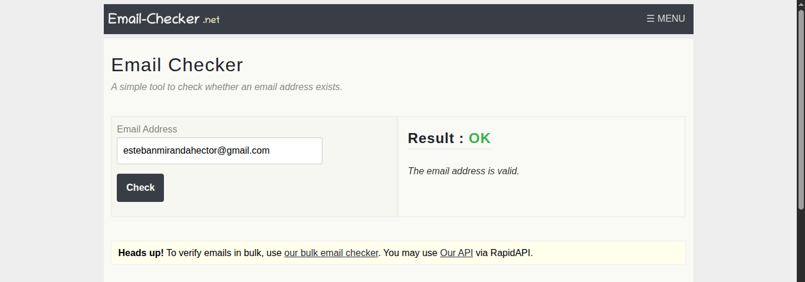
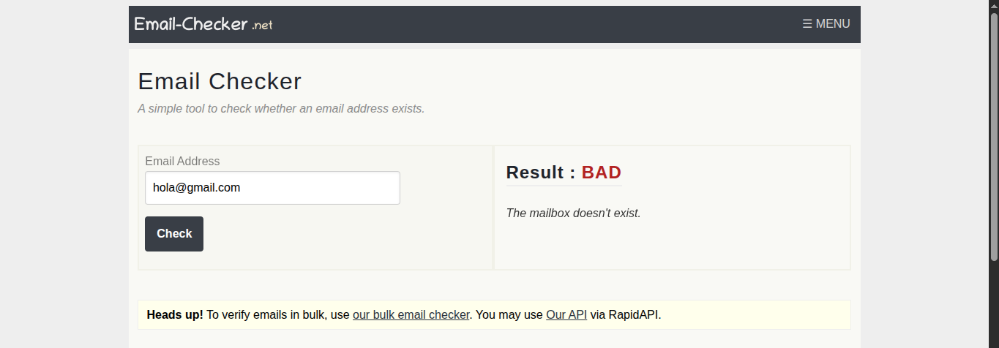
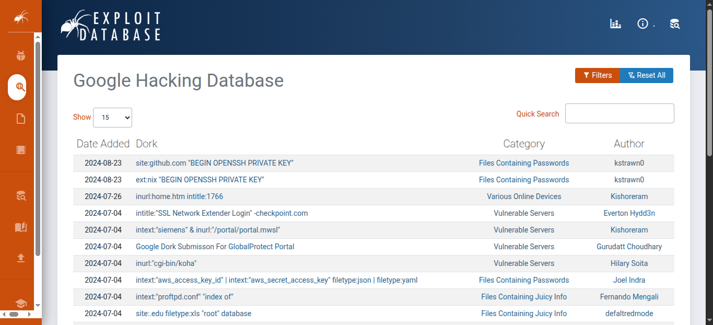
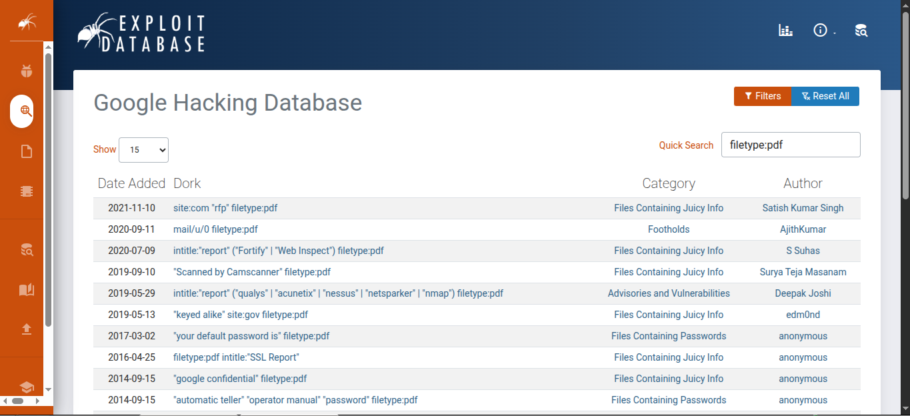

Grupo 4: [Enlace](https://docs.google.com/document/d/1HYB5ysluQT48IaaAoVoHTwkMw390diEZ/edit) 

[Presentación](https://docs.google.com/presentation/d/1rlwxk4t_ZnDCnZm1vi4iwsirxv7c2b_PuTRuQqUV370/edit?usp=sharing)

# Índice
1. Messageheader (Google): [https://toolbox.googleapps.com/apps/messageheader/](https://toolbox.googleapps.com/apps/messageheader/).
2. Browserling: [https://www.browserling.com/](https://www.browserling.com/).
3. Any.run: [https://any.run/](https://any.run/).
4. Verify Email: https://verifymail.io/.
5. Breach-parse: https://lnkd.in/duYp5hyF.
6. Email Checker: https://email-checker.net/.
7. Social Bearing: https://socialbearing.com/.
8. Baidu: https://www.baidu.com/.
9. Google-hacking-database : https://www.exploit-db.com/google-hacking-database.

# [Messageheader](https://toolbox.googleapps.com/apps/messageheader/)

Esta herramienta nos ayuda a ver información de los correos electrónicos. Cuando uno envía un correo electrónico, con este, se adjuntan ciertos metadatos que pueden ser usados para vulnerar la seguridad. Antiguamente, incluso, se podía ver desde qué IP se había mandado dicho correo, aunque era algo tan inseguro que Google empezó a enmascarar dichas IPs bajo las suyas propias. Igualmente, el uso de servicios de correo basados en STMP siguen manteniendo esta vulnerabilidad.

Típicamente, uno puede acceder a esta cabecera si hace clic en "Mostrar Original".


Y la herramienta presentada nos ayuda a pasar de esto:

```
Delivered-To: user@example.com
Received: by 2002:a05:612c:b03:b0:531:29e7:884d with SMTP id if3csp6568433vqb;
        Mon, 8 Dec 2025 22:25:50 -0800 (PST)
X-Forwarded-Encrypted: i=4; AJvYcCVtGd6InxEZ8yegaIk++61uryTmQsOGuME159iQjOIfzf8InBjN557AN64Rw2vSp9hGpQ2JQL/obYM=@lasalleinstitucion.es
X-Received: by 2002:a05:6214:5296:b0:882:3f45:c811 with SMTP id 6a1803df08f44-8883dc7382amr180743876d6.61.1765261550008;
        Mon, 08 Dec 2025 22:25:50 -0800 (PST)
ARC-Seal: i=3; a=rsa-sha256; t=1765261549; cv=pass;
        d=google.com; s=arc-20240605;
        b=MOVfDKH0S0fEh7P7ZVlzm9InkYmSLyYEVfDbjJxEGCuqW0zZzW6c4QB+sRKrPxWBGv
         neouRD7dlmWIsbDkIvGEaavA3Yfl1D5E2UJ/xPbdk8oEc5NRq+N5mgo2ItQoXUpNtnB1
         4xC0hlC8YIHhz0hLF1EWoRzG2+3G99NlI46JE5gqLZ6tQre01/nQiwa6AEoV46asegXj
         l6GUAC7Yz9wn+WjrzIZRT7bCrL+ya2143zAOCgDhrgwLYcCsnhXqr8ap4cFGMb+GPCqJ
         xG3wz2eLSsra0Z5o8MKvk7x4zKRU53LU6EYKUME0P7JrdRQ6WluZPGEHV9Iks5PlHa7q
         7rfA==
ARC-Message-Signature: i=3; a=rsa-sha256; c=relaxed/relaxed; d=google.com; s=arc-20240605;
        h=list-unsubscribe:list-archive:list-help:list-post:list-id
         :mailing-list:precedence:to:subject:message-id:date:from:in-reply-to
         :references:mime-version:dkim-signature;
        bh=7pazJhCWyZsxBFC8PyBGIm06RFu9HFx9hh0Ey2QHiHE=;
        fh=gbzq5RkPGvecNSQFkRxH4MLJ20gpR7rJ0FAdraiPodk=;
        b=JnCh5/FwWwOGtvliILQ3dW2Ofr3wKcKQ5gvG3Ij/mbP3399LQngTU0H9pPoWKe08Yg
         kGoFZKKFMKZhADH1ovlL4IwsnIII8hmw5NdfRkXGTLk50YfVQpFqY7v7KeJHLlGZC/4e
         X5vVO804nbEPVVQyyPEBfN+DMthMFZoaUxnjURH5dUw6HrAVWgtfL3dR1Yli1zLnYdID
         2/h6bLHa5Wbs9ZpyaAOZI1A6ZrFslaEcLFkuik6Cw6I+GtPfWsAtI0j1HiEDqgZC5/1Z
         Xz/Pl8x78CvFIg3Q+AGYrGT+7TPZ2rif6FjBtZjyfGPE+R5bz577WXQwFh6o8A9+kE+L
         9xKw==;
        dara=google.com
...
```

A esto:

| MessageId   | CAFEYC=1ivtWAc9ZAeG+Aat9_qqCKf-b1Ecc_2tCFU4T3011rpA@mail.gmail.com                                                                                                                                 |
| ----------- | -------------------------------------------------------------------------------------------------------------------------------------------------------------------------------------------------- |
| Created at: | 9/12/2025, 7:25:36 CET ( Delivered after 14 sec )                                                                                                                                                  |
| From:       | Alberto Kwech Sancha <afsanchez@lasalleinstitucion.es>                                                                                                                                             |
| To:         | Lista de correos que no voy a mostrar                                                                                                                                                              |
| Subject:    | Re: INFO ASIR2 ALUMNOS 2025                                                                                                                                                                        |
| SPF:        | pass con la IP 209.85.220.69<br><br>[Más información](https://support.google.com/a?p=show_original&hl=%20%20%20%20%20%20%20%20%20%20%20%20%20%20%20%20%20%20%20es%20target=%22_blank%22)           |
| DKIM:       | pass con el dominio lasalleinstitucion.es<br><br>[Más información](https://support.google.com/a?p=show_original&hl=%20%20%20%20%20%20%20%20%20%20%20%20%20%20%20%20%20%20es%20target=%22_blank%22) |
| ARC:        | **SPF:** pass con el dominio lasalleinstitucion.es<br><br>**DKIM:** pass con el dominio lasalleinstitucion.es<br><br>**DMARC:** pass con el dominio lasalleinstitucion.es                          |
| DMARC:      | pass<br><br>[Más información](https://support.google.com/a?p=show_original&hl=%20%20%20%20%20%20%20%20%20%20%20%20%20%20%20%20%20%20es%20target=%22_blank%22)                                      |

Además, nos informa de los tiempos:

| # | Delay | From | | | To | Protocol |Time received | |
| ----------- | ----------- | ----------- | ----------- | ----------- | ----------- | ----------- | ----------- | ----------- | 
|0|11 sec||→||2002:a05:622a:1105:b0:4f0:2b7e:c5c3||9/12/2025, 7:25:47 CET||
|1|1 sec|mail-sor-f41.google.com.|→|[Google]|mx.google.com||9/12/2025, 7:25:48 CET|_Originated at Gmail_|
|2|||→|[Google]|2002:a05:620a:bd3:b0:8b2:62f9:9fd8|[SMTP](http://goo.gl/LvgJt)|9/12/2025, 7:25:48 CET||
|3|||→|[Google]|2002:a05:6214:2e90:b0:882:63fc:f004||9/12/2025, 7:25:48 CET||
|4|1 sec||→|[Google]|2002:a05:6214:260a:b0:7e9:2697:dc63|[SMTP](http://goo.gl/LvgJt)|9/12/2025, 7:25:49 CET||
|5||mail-sor-f69.google.com.|→|[Google]|mx.google.com||9/12/2025, 7:25:49 CET||
|6|1 sec||→|[Google]|2002:a05:6214:5296:b0:882:3f45:c811|[SMTP](http://goo.gl/LvgJt)|9/12/2025, 7:25:50 CET||
|7|||→|[Google]|2002:a05:612c:b03:b0:531:29e7:884d|[SMTP](http://goo.gl/LvgJt)|9/12/2025, 7:25:50 CET||
# [Browserling](https://www.browserling.com/)

Esta página web nos permite emular otras páginas web junto con sus sistemas operativos (de forma predeterminada, Windows). Uno entra a dicha web, especifica a qué otra página web quiere acceder, y se inicia un navegador dentro de una máquina virtual que ponen a tu servicio por unos minutos. Extender el tiempo o usar otras aplicaciones (no todas) requiere de pagar el premium. En mi caso, he entrado en la propia web de Browserling dentro de Browserling, he iniciado Ubuntu WSL y he ejecutado el comando divertido por antonomasia: `rm -R / --no-preserve-root --force`.


# [Any.run](https://any.run/)

Any.run es una página web que presenta máquinas virtuales que ejecutan un software específico y monitorizan el sistema. Esto se hace para saber si el archivo posee algún tipo de malware o no. Haría una prueba para enseñar mejor cómo funciona, pero necesito una cuenta de correo empresarial fuera del dominio de Google, cosa que me es imposible. Igualmente, existen alternativas, como VirusTotal, que analiza de la mano de múltiples antivirus si el archivo seleccionado es un malware o no. Además, muestra los metadatos del archivo y en algunos casos, ejecuta internamente el archivo en una máquina virtual y monitoriza los cambios que realiza el ejecutable en el sistema operativo. Este es mi [reporte](https://www.virustotal.com/gui/file/80f87330ee7b4bc55bcb58ef10dfcdacba12c47c74bb8128f2f1cb9d86ec6815/behavior) para el archivo "logisim-evolution-4.0.0-amd64.msi". Si no fuese poco, la comunidad deja comentarios sobre el archivo para advertir a los nuevos usuarios.


# [Verify Email](https://verifymail.io/)

La página verifymail.io es una herramienta de verificación y validación de correos electrónicos.

Su propósito principal es ayudarte a limpiar tus listas de contactos para asegurar que los correos que envías lleguen a buzones de entrada reales y activos.

En términos sencillos, lo que hace es:

Verificar la validez de los correos: Comprueba si una dirección de correo existe y es funcional.

Reducir las tasas de rebote (bounce rates): Al eliminar los correos inválidos, evita que tu reputación como remitente se vea afectada negativamente.

Mejorar la entregabilidad: Asegura que tus mensajes de email marketing o transaccionales tengan más probabilidades de llegar a la bandeja de entrada y no a la carpeta de spam.

Ofrece servicios para verificar correos de forma individual, cargar listas enteras para limpieza masiva, e incluso buscar direcciones de correo profesionales.

## Prueba de verifymail


### Detalles del dominio gmail

| Característica Evaluada | Resultado del Reporte | Significado y Conclusión |
| ---- | ---- | ---- |
| Dominio | gmail.com | El dominio que fue verificado. |
| Servidor de Correo Válido | Verdadero | El servidor de correo existe y está configurado correctamente para recibir emails. |
| Proveedor de Email | Gmail | El servicio es proporcionado por Google. |
| Dominio Catch-All | Falso | Bueno para la verificación: El servidor no acepta *todos* los correos; solo acepta direcciones de usuario que realmente existen. |
| Correo Entregable | Falso | Normal: Solo se verificó el *dominio*, no una *dirección de correo específica*. La herramienta no puede garantizar la entregabilidad sin verificar la dirección completa. |
| Correo Desechable | Falso | Seguro: No es un servicio de correo temporal o de un solo uso. |
| Privacidad | Falso | El dominio no tiene configuraciones especiales que impidan la verificación. |
| Recomendación General | Seguro | El reporte concluye que gmail.com es un dominio seguro para enviar o recibir correo. |

### Nombres de Host y Prioridades del Servidor

| Hostname del Servidor de Correo | Prioridad (MX) |
| ---- | ---- |
| gmail-smtp-in.l.google.com | 5 (Principal) |
| alt1.gmail-smtp-in.l.google.com | 10 |
| alt2.gmail-smtp-in.l.google.com | 20 |
| alt3.gmail-smtp-in.l.google.com | 30 |
| alt4.gmail-smtp-in.l.google.com | 40 |

### Información Geográfica de las Direcciones IP del Servidor

| Dirección IP (v4/v6) | Ubicación Geográfica | Sistema Autónomo (AS) |
| ---- | ---- | ---- |
| 192.178.213.26 | United States | AS15169 \- GOOGLE |
| 2a00:1450:4013:c1e::1b | Groningen, The Netherlands | AS15169 \- GOOGLE |
| 142.250.147.27 | United States | AS15169 \- GOOGLE |
| 2a00:1450:4025:c01::1a | Billund, Denmark | AS15169 \- GOOGLE |
| 64.233.184.27 | United States | AS15169 \- GOOGLE |
| 2a00:1450:400c:c04::1a | Wallonia, Belgium | AS15169 \- GOOGLE |
| 172.253.144.26 | United States | AS15169 \- GOOGLE |
| 2404:6800:4003:c24::1a | Singapore | AS15169 \- GOOGLE |
| 172.253.130.26 | United States | AS15169 \- GOOGLE |
| 2a00:1450:4010:c20::1a | Kymenlaakso, Finland | AS15169 \- GOOGLE |

# [Breach-parse](https://lnkd.in/duYp5hyF/)


# [Email Checker](https://email-checker.net/)

El sitio web Email Checker es una herramienta gratuita que sirve para verificar si una dirección de correo electrónico es válida y existe.

Funciona comprobando lo siguiente:

- El formato de la dirección de correo.

- Si el nombre de dominio es válido.

- Si no es una dirección de correo desechable.

- Extrae los registros MX y se conecta al servidor de correo (simulando el envío de un mensaje) para confirmar que el buzón de correo realmente existe.

También ofrecen una herramienta premium para verificar listas de correos (verificador masivo) y una herramienta gratuita para extraer correos electrónicos de archivos de texto o documentos.

## Prueba de Email Checker

Probamos con una cuenta de correo que si existe



Probamos con una cuenta de correo que no existe



# [Social Bearing](https://socialbearing.com/)

Socialbearing.com fue una herramienta en línea de búsqueda y análisis de Twitter que permitía explorar datos, métricas y estadísticas de tweets, perfiles y tendencias en la plataforma Twitter. 

Actualmente, la página principal redirige a un artículo del creador explicando que el servicio dejó de funcionar debido a cambios en la API de Twitter (la forma en que herramientas externas acceden a datos).


Cuando estaba activa, Social Bearing ofrecía funciones como:

- Buscar tweets por palabra clave o hashtag.

- Analizar perfiles públicos de Twitter (cantidad de tweets, retweets, likes, etc.). 

- Filtrar resultados por idioma, tipo de tweet (respuesta, retweet, etc.) y sentimiento. 

- Mostrar estadísticas como influencia, engagement y mapas de tweets geolocalizados. 

- Extraer estadísticas detalladas sobre un usuario o tema. 

Internamente se apoyaba en la API pública de Twitter para obtener los datos antes de que esa API se volviera costosa o restrictiva.


SocialBearing servía para analizar perfiles de Twitter, medir el desempeño de tweets y hashtags, y estudiar tendencias o conversaciones en tiempo real. Era muy útil para profesionales como community managers, especialistas en marketing digital, periodistas e investigadores que necesitaban comprender la actividad y el impacto de contenidos específicos en redes sociales.


En su momento fue una herramienta muy útil porque ofrecía funciones avanzadas que la plataforma de Twitter no incluía. No obstante, actualmente ya no es funcional, por lo que no puede considerarse útil para análisis reales o actuales. La página en sí no se considera peligrosa, pero debido a que ya no ofrece servicios activos, solo funciona como un sitio inactivo sin herramientas de análisis.

Actualmente para poder solo ver esta herramienta podemos hacerlo desde "WayBackMachine":


# [Baidu](https://www.baidu.com/)

Baidu.com es el portal principal del gigante tecnológico chino Baidu, Inc., conocido principalmente por su motor de búsqueda en idioma chino, similar a Google. Fundado en el año 2000 por Robin Li y Eric Xu, Baidu se ha convertido en una de las compañías tecnológicas más importantes de China y del mundo en servicios de internet e inteligencia artificial.

Baidu funciona principalmente como un buscador web, respondiendo a miles de millones de consultas de usuarios cada día. Permite buscar páginas web, noticias, imágenes, videos y otro tipo de contenidos, aunque está adaptado al uso del idioma chino y al ecosistema web de China. Además del buscador, la empresa ofrece otros productos como mapas, enciclopedia colaborativa (Baidu Baike), almacenamiento en la nube, foros y más.

La página principal de Baidu sirve como punto de entrada para realizar búsquedas de información en internet, especialmente en China, donde es el motor de búsqueda dominante. También ofrece acceso a otros servicios del ecosistema Baidu, como noticias, mapas, foros y herramientas de inteligencia artificial.

Baidu es extremadamente útil si estás buscando información dentro del contexto de internet chino o en chino simplificado, ya que domina ese mercado con más del 50 % del tráfico de búsquedas en China y atiende a miles de millones de consultas diariamente. Para usuarios fuera de China o que buscan contenido global en otros idiomas, su utilidad puede estar limitada por el idioma y restricciones geográficas.

La pagina no se puede usar en nuestra region pero funcionaria como una busqueda de google:


# [Google-hacking-database](https://www.exploit-db.com/google-hacking-database)

La Google Hacking Database, conocida como GHDB, es una base de datos de consultas avanzadas de búsqueda que se alojaba y mantiene en el sitio de Exploit Database (Exploit-DB), un repositorio público de información sobre vulnerabilidades y técnicas relacionadas con la seguridad informática. 

GHDB forma parte de la familia de recursos que ofrece Exploit-DB, un proyecto de Offensive Security, que también gestiona grandes colecciones de exploits y herramientas para pruebas de penetración.

La GHDB funciona como un catálogo de consultas que utilizan operadores avanzados de Google, como intitle:, inurl: o filetype:. Estos operadores permiten filtrar los resultados de búsqueda para localizar archivos específicos, paneles de administración, mensajes de error o documentos expuestos. 

No es una herramienta automática: el usuario simplemente copia la consulta de la GHDB, la pega en Google y el motor de búsqueda devuelve los resultados correspondientes. Así, la GHDB actúa como una guía que muestra qué tipo de información puede estar accesible públicamente debido a una configuración incorrecta.

La GHDB sirve principalmente para auditorías de seguridad, pruebas de penetración y análisis OSINT. Los profesionales la utilizan para detectar datos expuestos, descubrir fallos de seguridad y evaluar qué información de un sitio web ha quedado accesible por error. 

También tiene un valor educativo, pues permite comprender cómo Google puede indexar contenido sensible cuando los administradores no protegen adecuadamente sus sistemas. En general, es una herramienta que ayuda a mejorar la seguridad indicando lo que cualquier persona podría encontrar si sabe qué buscar.

La GHDB es muy útil para especialistas en ciberseguridad, técnicos, pentesters e investigadores. Les permite identificar riesgos, corregir vulnerabilidades y aprender sobre exposición de información en Internet. Sin embargo, para un usuario común puede no resultar necesaria o incluso resultar confusa, ya que está orientada a un público técnico. 

Además, su uso debe ser siempre legal y ético: aunque muestra información pública indexada por Google, emplearla para acceder o intentar explotar sistemas es ilegal. En un contexto profesional y responsable, sí es una herramienta altamente útil y valiosa.

Ejemplo:



"filetype:pdf"


